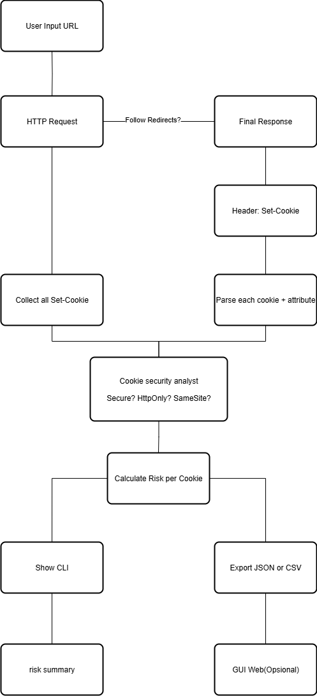

# 🍪 CookieSpy

CookieSpy is a simple tool for retrieving, displaying, and exporting cookies from a URL.  
Supports colorized CLI display (via `rich`), export to JSON/CSV, and a simple web-based GUI (Flask).

---

## FLowchart




## How to Install

Clone this repo
```bash
https://github.com/fdhliakbar/CookieSpy.git
```

Install requirements
```bash
pip install -r requirements.txt
```

## How to Use

<!-- With CLI
```bash
# example 01
python cookiespy.py https://httpbin.org/cookies/set?testcookie=value

# example 02
python cookiespy.py https://github.com
```

CLI with Export cookies
```bash
# fromat json
python cookiespy.py <URL> --export json

# format csv
python cookiespy.py <URL> --export csv

```

With GUI
```bash
python webapp.py
```
Enter the URL → click **Fetch Cookies** → the results will be displayed in the table.

---

### Example

```bash
python cookiespy.py https://github.com
```

### Output

```bash
🔍 Mengambil cookies...

✔ Cookies ditemukan: {'_gh_sess': 
'3TLOJqcMKU9Mi5JN8EkecauN9FsSaImjhCOiKu8YDXpalofmkZbBe1xYtVDBFYf6bmbNh6MTfg8IVY2wsq%2FVN46DF2ok51y2O%2FHGYnq1X8qXX3zLmRFtZzierEp1O%2BuPy9StY3jL11vTVDNmjvX2%2Bdfy99JZ0fZOc
Dle6ZmLE0%2F8kvP6oMMB%2FGhOb0jGTwRPpEuAfmy%2BFmoGfg%2FqUZTpNk6JvPifKDVLAFwVPH08JyFwuf2YxM1tRs1S2Rx7H%2B%2Blo8mLWUKKDpVeGaONLYeNbQ%3D%3D--2bPnIxmDdV4DSGDx--L5Zjb9nicw2HqWy
0LoVW%2BQ%3D%3D', '_octo': 'GH1.1.89567047.1755552745', 'logged_in': 'no'}
``` -->

### Install Packages

```bash
pip install dist/cookiespy-0.1.0-py3-none-any.whl

Installing collected packages: cookiespy
Successfully installed cookiespy-0.1.0
```

### Run Program with CLI(Command Line Interface)
```bash
# Export with JSON
cookiespy https://youtube.com/ --export json

# Export with CSV
cookiespy https://youtube.com/ --export csv

```

### Output
``` bash
Fetching cookies from: https://youtube.com/
Cookies found: {'GPS': '1', 'YSC': 'vsffeGLJxhU', 'VISITOR_INFO1_LIVE': '-F5Uurh13H0', 'VISITOR_PRIVACY_METADATA': 'CgJJRBIEGgAgYA%3D%3D', '__Secure-ROLLOUT_TOKEN': 
'COi1zMK9u_uNCxDTlJ2jw5mPAxjTlJ2jw5mPAw%3D%3D'}
[+] Cookies diexport ke cookies.json
Exported cookies to cookies.json
```

## Testing

Before testing, you must install the required packages. You can install all the required packages by

```bash
#Install requirement first
pip install -r requirements.txt


# Then you can enter the directory and run the program like this
cd test; pytest -v testing.py

# Output 

========================================================================== test session starts ==========================================================================
platform win32 -- Python 3.13.3, pytest-8.4.1, pluggy-1.6.0 -- C:\Users\USER\AppData\Local\Programs\Python\Python313\python.exe
cachedir: .pytest_cache
rootdir: E:\Github-Database\CookieSpy
configfile: pyproject.toml
plugins: anyio-4.9.0
collected 1 item                                                                                                                                                         

testing.py::test_fetch_cookies_google PASSED                                                                                                                       [100%]

=========================================================================== 1 passed in 1.25s ===========================================================================
```

---


